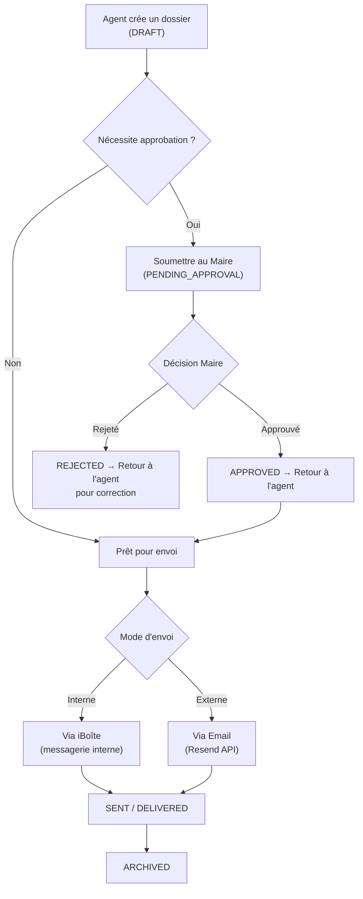

# 📬 iCorrespondance — Guide d'Implémentation Complet

> **Extrait du projet `mairie.ga`** — Module de gestion de correspondance officielle inter-administrations avec workflow d'approbation, envoi interne (iBoîte) et externe (email via Resend).

---

## Table des Matières

1. [Architecture Globale](#1-architecture-globale)
2. [Schéma de Base de Données (Supabase)](#2-schéma-de-base-de-données)
3. [Services TypeScript](#3-services-typescript)
4. [Composants React](#4-composants-react)
5. [Edge Function (Email)](#5-edge-function-email)
6. [Données de Référence](#6-données-de-référence)
7. [Intégrations & Dépendances](#7-intégrations--dépendances)
8. [Routing](#8-routing)
9. [Checklist d'implémentation](#9-checklist-dimplémentation)

---

## 1. Architecture Globale

### Flux métier



### Statuts du dossier

| Statut | Description |
|--------|-------------|
| `DRAFT` | Brouillon, en cours de rédaction |
| `PENDING_APPROVAL` | En attente d'approbation (Maire/Adjoint) |
| `APPROVED` | Approuvé, prêt pour envoi |
| `REJECTED` | Rejeté, retourné à l'agent |
| `READY_FOR_DELIVERY` | Prêt pour remise physique ou numérique |
| `DELIVERED` | Document remis (impression ou iBoîte) |
| `SENT` | Correspondance envoyée (email ou iBoîte) |
| `ARCHIVED` | Archivé |

### Rôles autorisés

```typescript
export const CORRESPONDANCE_AUTHORIZED_ROLES = [
    'MAIRE', 'maire',
    'MAIRE_ADJOINT', 'maire_adjoint',
    'SECRETAIRE_GENERAL', 'secretaire_general',
    'CHEF_SERVICE', 'chef_service',
    'AGENT', 'agent',
    'SUPER_ADMIN', 'super_admin', 'admin',
];
```

### Stack technique

| Couche | Technologie |
|--------|------------|
| Frontend | React 18 + TypeScript + Vite |
| UI | shadcn/ui + Tailwind CSS + Framer Motion |
| Backend | Supabase (PostgreSQL + Auth + Storage + Edge Functions) |
| Email | Resend API |
| Messagerie interne | iBoîte (tables Supabase custom) |
| IA enrichissement | Edge Function `enrich-document-content` |

---

## 2. Schéma de Base de Données

### 2.1 Table `icorrespondance_folders` (Dossiers)

```sql
CREATE TABLE public.icorrespondance_folders (
    id UUID PRIMARY KEY DEFAULT gen_random_uuid(),
    user_id UUID NOT NULL REFERENCES auth.users(id) ON DELETE CASCADE,
    organization_id UUID REFERENCES public.organizations(id),
    
    -- Identification
    name TEXT NOT NULL,
    reference_number TEXT UNIQUE,  -- Auto-généré: "CORR-2024-00001"
    
    -- Destinataire
    recipient_name TEXT,
    recipient_organization TEXT,
    recipient_email TEXT,             -- Pour envoi externe
    recipient_user_id UUID REFERENCES auth.users(id),  -- Pour envoi interne iBoîte
    
    -- Contenu
    comment TEXT,
    
    -- Statut et flags
    status TEXT NOT NULL DEFAULT 'DRAFT' 
        CHECK (status IN ('DRAFT', 'PENDING_APPROVAL', 'APPROVED', 'SENT', 'ARCHIVED')),
    is_urgent BOOLEAN DEFAULT false,
    is_read BOOLEAN DEFAULT true,
    is_internal BOOLEAN DEFAULT false,  -- true = iBoîte, false = email externe
    
    -- Workflow
    current_holder_id UUID,           -- Qui détient le dossier actuellement
    requires_approval BOOLEAN DEFAULT false,
    approved_by_id UUID,
    approved_at TIMESTAMP WITH TIME ZONE,
    delivery_method TEXT,             -- 'PRINT' | 'IBOITE' | 'PENDING'
    delivered_at TIMESTAMP WITH TIME ZONE,
    
    -- Liaison iBoîte
    iboite_conversation_id UUID REFERENCES public.iboite_conversations(id),
    
    -- Timestamps
    sent_at TIMESTAMP WITH TIME ZONE,
    created_at TIMESTAMP WITH TIME ZONE NOT NULL DEFAULT now(),
    updated_at TIMESTAMP WITH TIME ZONE DEFAULT now()
);

-- Index
CREATE INDEX idx_icorr_folders_user ON public.icorrespondance_folders(user_id);
CREATE INDEX idx_icorr_folders_org ON public.icorrespondance_folders(organization_id);
CREATE INDEX idx_icorr_folders_status ON public.icorrespondance_folders(status);
CREATE INDEX idx_icorr_folders_created ON public.icorrespondance_folders(created_at DESC);
CREATE INDEX idx_icorr_folders_holder ON public.icorrespondance_folders(current_holder_id);
CREATE INDEX idx_icorr_folders_approval ON public.icorrespondance_folders(requires_approval, status);
```

### 2.2 Table `icorrespondance_documents` (Pièces jointes)

```sql
CREATE TABLE public.icorrespondance_documents (
    id UUID PRIMARY KEY DEFAULT gen_random_uuid(),
    folder_id UUID NOT NULL REFERENCES public.icorrespondance_folders(id) ON DELETE CASCADE,
    
    -- Fichier
    name TEXT NOT NULL,
    file_path TEXT,          -- Chemin dans Supabase Storage
    file_type TEXT DEFAULT 'pdf',  -- 'pdf' | 'doc' | 'image' | 'other'
    file_size TEXT,          -- Taille formatée "2.4 MB"
    file_url TEXT,           -- URL temporaire ou blob URL
    
    -- Contenu généré (si créé par IA)
    is_generated BOOLEAN DEFAULT false,
    generator_type TEXT,     -- Type de générateur utilisé
    
    created_at TIMESTAMP WITH TIME ZONE NOT NULL DEFAULT now()
);

CREATE INDEX idx_icorr_docs_folder ON public.icorrespondance_documents(folder_id);
```

### 2.3 Table `icorrespondance_workflow_steps` (Historique workflow)

```sql
-- Enum des types d'étapes
DO $$ BEGIN
    CREATE TYPE workflow_step_type AS ENUM (
        'CREATED', 'SENT_FOR_APPROVAL', 'VIEWED', 'APPROVED',
        'REJECTED', 'MODIFICATION_REQUESTED', 'RETURNED_TO_AGENT',
        'READY_FOR_DELIVERY', 'DELIVERED_PRINT', 'DELIVERED_IBOITE', 'ARCHIVED'
    );
EXCEPTION WHEN duplicate_object THEN null;
END $$;

CREATE TABLE public.icorrespondance_workflow_steps (
    id UUID PRIMARY KEY DEFAULT gen_random_uuid(),
    folder_id UUID NOT NULL REFERENCES public.icorrespondance_folders(id) ON DELETE CASCADE,
    step_type TEXT NOT NULL,
    actor_id UUID NOT NULL,
    actor_name TEXT,
    actor_role TEXT,
    target_id UUID,
    target_name TEXT,
    comment TEXT,
    is_read BOOLEAN DEFAULT false,
    read_at TIMESTAMP WITH TIME ZONE,
    created_at TIMESTAMP WITH TIME ZONE DEFAULT now()
);

CREATE INDEX idx_workflow_folder ON public.icorrespondance_workflow_steps(folder_id);
CREATE INDEX idx_workflow_actor ON public.icorrespondance_workflow_steps(actor_id);
CREATE INDEX idx_workflow_target ON public.icorrespondance_workflow_steps(target_id);
CREATE INDEX idx_workflow_created ON public.icorrespondance_workflow_steps(created_at DESC);
```

### 2.4 Table `correspondence_logs` (Logs d'envoi email)

> [!NOTE]
> Table séparée pour tracer les envois email via l'Edge Function.

```sql
-- Cette table est référencée par l'Edge Function send-official-correspondence
-- Structure déduite du code:
CREATE TABLE public.correspondence_logs (
    id UUID PRIMARY KEY DEFAULT gen_random_uuid(),
    sender_id UUID NOT NULL REFERENCES auth.users(id),
    recipient_org TEXT,
    recipient_name TEXT,
    recipient_email TEXT,
    subject TEXT NOT NULL,
    content TEXT,
    document_ids UUID[] DEFAULT '{}',
    is_urgent BOOLEAN DEFAULT false,
    folder_id UUID REFERENCES public.icorrespondance_folders(id),
    status TEXT DEFAULT 'PENDING' 
        CHECK (status IN ('PENDING', 'SENT', 'DELIVERED', 'FAILED', 'BOUNCED')),
    sent_at TIMESTAMP WITH TIME ZONE,
    delivered_at TIMESTAMP WITH TIME ZONE,
    error_message TEXT,
    template_used TEXT,
    attachments TEXT[] DEFAULT '{}',
    metadata JSONB DEFAULT '{}',
    created_at TIMESTAMP WITH TIME ZONE DEFAULT now()
);
```

### 2.5 Storage Bucket

```sql
-- Bucket privé pour les documents iCorrespondance
INSERT INTO storage.buckets (id, name, public)
VALUES ('icorrespondance-documents', 'icorrespondance-documents', false)
ON CONFLICT (id) DO NOTHING;

-- Policies Storage
CREATE POLICY "Users can upload icorrespondance documents"
ON storage.objects FOR INSERT
WITH CHECK (bucket_id = 'icorrespondance-documents' AND auth.uid() IS NOT NULL);

CREATE POLICY "Users can view icorrespondance documents"
ON storage.objects FOR SELECT
USING (bucket_id = 'icorrespondance-documents' AND auth.uid() IS NOT NULL);

CREATE POLICY "Users can delete icorrespondance documents"
ON storage.objects FOR DELETE
USING (bucket_id = 'icorrespondance-documents' AND auth.uid() IS NOT NULL);

CREATE POLICY "Users can update icorrespondance documents"
ON storage.objects FOR UPDATE
USING (bucket_id = 'icorrespondance-documents' AND auth.uid() IS NOT NULL);
```

### 2.6 RLS Policies (Row Level Security)

```sql
ALTER TABLE public.icorrespondance_folders ENABLE ROW LEVEL SECURITY;
ALTER TABLE public.icorrespondance_documents ENABLE ROW LEVEL SECURITY;
ALTER TABLE public.icorrespondance_workflow_steps ENABLE ROW LEVEL SECURITY;

-- Folders
CREATE POLICY "Users can view own folders"
ON public.icorrespondance_folders FOR SELECT
USING (auth.uid() = user_id);

CREATE POLICY "Users can create own folders"
ON public.icorrespondance_folders FOR INSERT
WITH CHECK (auth.uid() = user_id);

CREATE POLICY "Users can update own or held folders"
ON public.icorrespondance_folders FOR UPDATE
USING (auth.uid() = user_id OR auth.uid() = current_holder_id);

CREATE POLICY "Users can delete own folders"
ON public.icorrespondance_folders FOR DELETE
USING (auth.uid() = user_id);

CREATE POLICY "Admins can view all folders"
ON public.icorrespondance_folders FOR SELECT
USING (has_role(auth.uid(), 'admin') OR has_role(auth.uid(), 'super_admin'));

-- Documents: accès via le dossier parent
CREATE POLICY "Users can view documents in own folders"
ON public.icorrespondance_documents FOR SELECT
USING (EXISTS (
    SELECT 1 FROM public.icorrespondance_folders f
    WHERE f.id = folder_id AND f.user_id = auth.uid()
));

-- Workflow Steps: accès si propriétaire ou détenteur du dossier
CREATE POLICY "Users can view workflow steps of accessible folders"
ON public.icorrespondance_workflow_steps FOR SELECT
USING (EXISTS (
    SELECT 1 FROM public.icorrespondance_folders f
    WHERE f.id = folder_id AND (
        f.user_id = auth.uid() OR f.current_holder_id = auth.uid()
    )
));
```

### 2.7 Fonctions et Triggers

```sql
-- Auto-génération du numéro de référence
CREATE OR REPLACE FUNCTION generate_icorr_reference()
RETURNS TRIGGER AS $$
BEGIN
    NEW.reference_number := 'CORR-' || TO_CHAR(NOW(), 'YYYY') || '-' 
        || LPAD(CAST(FLOOR(RANDOM() * 100000) AS TEXT), 5, '0');
    RETURN NEW;
END;
$$ LANGUAGE plpgsql;

CREATE TRIGGER set_icorr_reference
BEFORE INSERT ON public.icorrespondance_folders
FOR EACH ROW
WHEN (NEW.reference_number IS NULL)
EXECUTE FUNCTION generate_icorr_reference();

-- Création d'étape de workflow avec résolution automatique des noms
CREATE OR REPLACE FUNCTION public.create_workflow_step(
    p_folder_id UUID,
    p_step_type TEXT,
    p_target_id UUID DEFAULT NULL,
    p_comment TEXT DEFAULT NULL
)
RETURNS UUID
LANGUAGE plpgsql
SECURITY DEFINER
SET search_path = public
AS $$
DECLARE
    v_step_id UUID;
    v_actor_name TEXT;
    v_actor_role TEXT;
    v_target_name TEXT;
BEGIN
    SELECT 
        COALESCE(p.first_name || ' ' || p.last_name, p.email),
        COALESCE(ur.role::TEXT, 'citizen')
    INTO v_actor_name, v_actor_role
    FROM public.profiles p
    LEFT JOIN public.user_roles ur ON ur.user_id = p.user_id
    WHERE p.user_id = auth.uid();

    IF p_target_id IS NOT NULL THEN
        SELECT COALESCE(p.first_name || ' ' || p.last_name, p.email)
        INTO v_target_name
        FROM public.profiles p WHERE p.user_id = p_target_id;
    END IF;

    INSERT INTO public.icorrespondance_workflow_steps (
        folder_id, step_type, actor_id, actor_name, actor_role,
        target_id, target_name, comment
    ) VALUES (
        p_folder_id, p_step_type, auth.uid(), v_actor_name, v_actor_role,
        p_target_id, v_target_name, p_comment
    ) RETURNING id INTO v_step_id;

    RETURN v_step_id;
END;
$$;

-- Auto-update read_at quand is_read passe à true
CREATE OR REPLACE FUNCTION public.update_read_at_timestamp()
RETURNS TRIGGER AS $$
BEGIN
    NEW.read_at = now();
    RETURN NEW;
END;
$$ LANGUAGE plpgsql;

CREATE TRIGGER update_workflow_steps_read_at
BEFORE UPDATE OF is_read ON public.icorrespondance_workflow_steps
FOR EACH ROW
WHEN (NEW.is_read = true AND OLD.is_read = false)
EXECUTE FUNCTION public.update_read_at_timestamp();
```

---

## 3. Services TypeScript

### 3.1 `correspondanceService.ts` — Service principal

```typescript
/**
 * Correspondance Service
 * Manages official correspondence for municipal staff
 */

import { supabase } from "@/integrations/supabase/client";
import { documentGenerationService, DOCUMENT_TEMPLATES } from "./documentGenerationService";
import { invokeWithDemoFallback } from "@/utils/demoMode";

// Types
export interface CorrespondanceFolder {
    id: string;
    name: string;
    sender: {
        name: string;
        organization: string;
        email?: string;
    };
    date: string;
    comment: string;
    documents: CorrespondanceDocument[];
    isUrgent?: boolean;
    isRead: boolean;
}

export interface CorrespondanceDocument {
    id: string;
    name: string;
    type: 'pdf' | 'doc' | 'image' | 'other';
    size: string;
    date: string;
    content?: string;
    filePath?: string;
}

export interface CreateCorrespondanceParams {
    recipient: string;
    recipientOrg: string;
    recipientEmail?: string;
    subject: string;
    contentPoints: string[];
    template?: keyof typeof DOCUMENT_TEMPLATES;
    signatureAuthority?: string;
}

export interface SendCorrespondanceParams {
    folderId?: string;
    documentId?: string;
    recipientEmail: string;
    recipientName?: string;
    recipientOrg?: string;
    subject?: string;
    body?: string;
    attachmentPath?: string;
    isUrgent?: boolean;
}

export interface WorkflowStep {
    id: string;
    folder_id: string;
    step_type: string;
    actor_id: string;
    actor_name?: string;
    actor_role?: string;
    target_id?: string;
    target_name?: string;
    comment?: string;
    is_read: boolean;
    read_at?: string;
    created_at: string;
}

class CorrespondanceService {

    /** Check if user has access to correspondance features */
    hasAccess(userRole: string): boolean {
        return CORRESPONDANCE_AUTHORIZED_ROLES.includes(userRole);
    }

    /** Read a correspondence folder - returns content for voice reading */
    async readCorrespondance(folderId: string): Promise<{
        folderName: string;
        sender: string;
        organization: string;
        date: string;
        comment: string;
        documentCount: number;
        documentNames: string[];
        summary: string;
    }> {
        const mockFolders = await this.getMockFolders();
        const folder = mockFolders.find(f => f.id === folderId);
        if (!folder) throw new Error(`Dossier non trouvé: ${folderId}`);

        await this.markAsRead(folderId);

        const summary = `
            Dossier: ${folder.name}.
            Envoyé par ${folder.sender.name} de ${folder.sender.organization}.
            ${folder.isUrgent ? 'Ce dossier est marqué comme urgent.' : ''}
            Ce dossier contient ${folder.documents.length} document(s).
        `.trim().replace(/\s+/g, ' ');

        return {
            folderName: folder.name,
            sender: folder.sender.name,
            organization: folder.sender.organization,
            date: folder.date,
            comment: folder.comment,
            documentCount: folder.documents.length,
            documentNames: folder.documents.map(d => d.name),
            summary
        };
    }

    /** File a correspondence to user's Documents folder */
    async fileToDocuments(folderId: string): Promise<{
        success: boolean;
        destinationPath: string;
        documentIds: string[];
    }> {
        const { data: { user } } = await supabase.auth.getUser();
        if (!user) throw new Error("Utilisateur non authentifié");

        const mockFolders = await this.getMockFolders();
        const folder = mockFolders.find(f => f.id === folderId);
        if (!folder) throw new Error(`Dossier non trouvé: ${folderId}`);

        const documentIds: string[] = [];
        const destinationPath = `correspondance/${folder.name.replace(/[^a-zA-Z0-9]/g, '_')}`;

        for (const doc of folder.documents) {
            const { data } = await supabase
                .from('documents')
                .insert({
                    user_id: user.id,
                    name: doc.name,
                    file_path: `${destinationPath}/${doc.name}`,
                    file_type: doc.type === 'pdf' ? 'application/pdf' : 'application/octet-stream',
                    file_size: parseInt(doc.size) || 0,
                    category: 'correspondance',
                })
                .select('id').single();
            if (data) documentIds.push(data.id);
        }

        return { success: true, destinationPath, documentIds };
    }

    /** Create a new official correspondence as PDF (with optional AI enrichment) */
    async createCorrespondance(params: CreateCorrespondanceParams): Promise<{
        blob: Blob;
        fileName: string;
        documentId: string;
        localUrl: string;
    }> {
        const { recipient, recipientOrg, subject, contentPoints, 
                template = 'courrier', signatureAuthority } = params;

        const templateToType: Record<string, string> = {
            'courrier': 'lettre', 'lettre': 'lettre',
            'note': 'note_service', 'note_service': 'note_service',
            'communique': 'communique', 'attestation': 'attestation'
        };
        const documentType = templateToType[template] || 'lettre';
        let enrichedContentPoints = contentPoints;

        // Enrich content using AI if minimal
        const needsEnrichment = !contentPoints || contentPoints.length === 0 
            || contentPoints.every(p => p.length < 50);

        if (needsEnrichment) {
            try {
                const enrichedContent = await this.enrichContent({
                    documentType, subject,
                    userInput: contentPoints?.join(' ') || '',
                    recipient, recipientOrg
                });
                if (enrichedContent.success && enrichedContent.contentPoints.length > 0) {
                    enrichedContentPoints = enrichedContent.contentPoints;
                }
            } catch (error) {
                console.warn('[Correspondance] Could not enrich content:', error);
            }
        }

        const result = await documentGenerationService.generateDocument({
            title: subject, content: '',
            template: documentType as any, format: 'pdf',
            recipient, recipientOrg, contentPoints: enrichedContentPoints,
            signatureAuthority,
            onProgress: (progress, status) => console.log(`[Correspondance] ${progress}% - ${status}`)
        });

        return {
            blob: result.blob, fileName: result.fileName,
            documentId: result.documentId,
            localUrl: URL.createObjectURL(result.blob)
        };
    }

    /** Enrich document content using AI (Edge Function) */
    async enrichContent(params: {
        documentType: string;
        subject: string;
        userInput?: string;
        recipient?: string;
        recipientOrg?: string;
    }): Promise<{ success: boolean; contentPoints: string[]; closingPhrase?: string }> {
        try {
            const { data, error, isDemo } = await invokeWithDemoFallback('enrich-document-content', {
                documentType: params.documentType,
                subject: params.subject,
                userInput: params.userInput,
                recipient: params.recipient,
                recipientOrg: params.recipientOrg,
                language: 'fr'
            });

            if (error) return { success: false, contentPoints: [] };
            if (isDemo) {
                return {
                    success: true,
                    contentPoints: [
                        'Suite à votre demande concernant ' + params.subject + ',',
                        'nous avons le plaisir de vous informer que votre dossier a été traité.',
                        'Nous restons à votre disposition pour tout complément d\'information.'
                    ],
                    closingPhrase: 'Veuillez agréer, Madame, Monsieur, l\'expression de nos salutations distinguées.'
                };
            }
            return {
                success: data?.success || false,
                contentPoints: data?.contentPoints || [],
                closingPhrase: data?.closingPhrase
            };
        } catch (error) {
            return { success: false, contentPoints: [] };
        }
    }

    /** Send correspondence via email (Edge Function) */
    async sendCorrespondance(params: SendCorrespondanceParams): Promise<{
        success: boolean;
        messageId?: string;
        sentAt: string;
    }> {
        const { data, error, isDemo } = await invokeWithDemoFallback('send-official-correspondence', {
            recipient_email: params.recipientEmail,
            recipient_org: params.recipientOrg || 'Destinataire',
            recipient_name: params.recipientName || '',
            subject: params.subject || 'Correspondance Officielle',
            content: params.body || 'Veuillez trouver ci-joint notre correspondance officielle.',
            document_ids: params.documentId ? [params.documentId] : [],
            is_urgent: params.isUrgent || false
        });

        if (error) throw new Error(`Erreur lors de l'envoi: ${error.message}`);

        const { data: { user } } = await supabase.auth.getUser();
        if (user) {
            console.log('[Correspondance] Email sent:', {
                user_id: user.id,
                recipient_email: params.recipientEmail,
                sent_at: new Date().toISOString(),
                demo_mode: isDemo
            });
        }

        return {
            success: true,
            messageId: data?.messageId || (isDemo ? `demo-${Date.now()}` : undefined),
            sentAt: new Date().toISOString()
        };
    }

    // ===== WORKFLOW METHODS =====

    /** Submit folder for approval */
    async submitForApproval(folderId: string, approverId: string, comment?: string) {
        const { data: { user } } = await supabase.auth.getUser();
        if (!user) throw new Error('Non authentifié');

        await (supabase.from as any)('icorrespondance_folders')
            .update({
                status: 'PENDING_APPROVAL',
                current_holder_id: approverId,
                requires_approval: true,
            })
            .eq('id', folderId);

        const { data: step } = await (supabase.from as any)('icorrespondance_workflow_steps')
            .insert({
                folder_id: folderId,
                step_type: 'SENT_FOR_APPROVAL',
                actor_id: user.id,
                target_id: approverId,
                comment: comment || 'Soumis pour approbation',
            })
            .select().single();

        return { success: true, stepId: step?.id };
    }

    /** Approve folder (Maire/Adjoint action) */
    async approveFolder(folderId: string, comment?: string) {
        const { data: { user } } = await supabase.auth.getUser();
        if (!user) throw new Error('Non authentifié');

        const { data: folder } = await (supabase.from as any)('icorrespondance_folders')
            .select('user_id').eq('id', folderId).single();

        await (supabase.from as any)('icorrespondance_folders')
            .update({
                status: 'APPROVED',
                approved_by_id: user.id,
                approved_at: new Date().toISOString(),
                current_holder_id: folder?.user_id,
            })
            .eq('id', folderId);

        await (supabase.from as any)('icorrespondance_workflow_steps')
            .insert({
                folder_id: folderId,
                step_type: 'APPROVED',
                actor_id: user.id,
                target_id: folder?.user_id,
                comment: comment || 'Approuvé',
            });

        return { success: true };
    }

    /** Reject folder with reason */
    async rejectFolder(folderId: string, reason: string) {
        const { data: { user } } = await supabase.auth.getUser();
        if (!user) throw new Error('Non authentifié');

        const { data: folder } = await (supabase.from as any)('icorrespondance_folders')
            .select('user_id').eq('id', folderId).single();

        await (supabase.from as any)('icorrespondance_folders')
            .update({
                status: 'REJECTED',
                current_holder_id: folder?.user_id,
            })
            .eq('id', folderId);

        await (supabase.from as any)('icorrespondance_workflow_steps')
            .insert({
                folder_id: folderId,
                step_type: 'REJECTED',
                actor_id: user.id,
                target_id: folder?.user_id,
                comment: reason,
            });

        return { success: true };
    }

    /** Mark folder as delivered */
    async markAsDelivered(folderId: string, method: 'PRINT' | 'IBOITE') {
        const { data: { user } } = await supabase.auth.getUser();
        if (!user) throw new Error('Non authentifié');

        const stepType = method === 'PRINT' ? 'DELIVERED_PRINT' : 'DELIVERED_IBOITE';
        const comment = method === 'PRINT'
            ? 'Document imprimé et remis à l\'usager'
            : 'Document envoyé via iBoîte';

        await (supabase.from as any)('icorrespondance_folders')
            .update({
                status: 'DELIVERED',
                delivery_method: method,
                delivered_at: new Date().toISOString(),
            })
            .eq('id', folderId);

        await (supabase.from as any)('icorrespondance_workflow_steps')
            .insert({
                folder_id: folderId,
                step_type: stepType,
                actor_id: user.id,
                comment: comment,
            });

        return { success: true };
    }

    /** Get workflow history for a folder */
    async getWorkflowHistory(folderId: string): Promise<WorkflowStep[]> {
        const { data, error } = await (supabase.from as any)('icorrespondance_workflow_steps')
            .select('*')
            .eq('folder_id', folderId)
            .order('created_at', { ascending: true });

        if (error) { console.error('[Workflow] Error:', error); return []; }
        return data || [];
    }

    /** Get folders pending approval (for Maire/Adjoint) */
    async getFoldersPendingApproval(): Promise<any[]> {
        const { data: { user } } = await supabase.auth.getUser();
        if (!user) return [];

        const { data, error } = await (supabase.from as any)('icorrespondance_folders')
            .select('*, documents:icorrespondance_documents(*)')
            .eq('current_holder_id', user.id)
            .eq('status', 'PENDING_APPROVAL')
            .order('created_at', { ascending: false });

        if (error) return [];
        return data || [];
    }

    async markAsRead(folderId: string): Promise<void> {
        console.log(`[Correspondance] Marked folder ${folderId} as read`);
    }

    async getUnreadCount(): Promise<number> {
        const folders = await this.getMockFolders();
        return folders.filter(f => !f.isRead).length;
    }

    async getMockFolders(): Promise<CorrespondanceFolder[]> {
        return [
            {
                id: 'folder-1',
                name: 'Permis de construire - Zone Industrielle',
                sender: { name: 'M. Ndong', organization: 'Mairie de Port-Gentil' },
                date: '2024-12-07',
                comment: 'Suite à notre entretien...',
                isUrgent: true, isRead: false,
                documents: [
                    { id: 'd1', name: 'Demande_Permis.pdf', type: 'pdf', size: '2.4 MB', date: '2024-12-07' },
                ],
            },
        ];
    }
}

export const correspondanceService = new CorrespondanceService();
```

### 3.2 `correspondence-log-service.ts` — Service logs d'envoi

```typescript
import { supabase } from '@/integrations/supabase/client';

export type CorrespondenceStatus = 'PENDING' | 'SENT' | 'DELIVERED' | 'FAILED' | 'BOUNCED';

export interface CorrespondenceLog {
    id: string;
    senderId: string;
    recipientEmail: string;
    recipientName?: string;
    subject: string;
    content?: string;
    templateUsed?: string;
    status: CorrespondenceStatus;
    sentAt?: string;
    deliveredAt?: string;
    errorMessage?: string;
    attachments: string[];
    metadata: Record<string, unknown>;
    createdAt: string;
}

const correspondenceTable = () => (supabase as any).from('correspondence_logs');

class CorrespondenceLogService {
    async getMyCorrespondence(): Promise<CorrespondenceLog[]> {
        const { data: { user } } = await supabase.auth.getUser();
        if (!user) return [];
        const { data, error } = await correspondenceTable()
            .select('*').eq('sender_id', user.id)
            .order('created_at', { ascending: false });
        if (error) return [];
        return (data || []).map((row: any) => this.mapFromDatabase(row));
    }

    async getAll(filters?: { status?: CorrespondenceStatus }): Promise<CorrespondenceLog[]> {
        let query = correspondenceTable().select('*');
        if (filters?.status) query = query.eq('status', filters.status);
        const { data, error } = await query.order('created_at', { ascending: false });
        if (error) return [];
        return (data || []).map((row: any) => this.mapFromDatabase(row));
    }

    async log(params: {
        recipientEmail: string; recipientName?: string;
        subject: string; content?: string;
        templateUsed?: string; attachments?: string[];
        metadata?: Record<string, unknown>;
    }): Promise<CorrespondenceLog> {
        const { data: { user } } = await supabase.auth.getUser();
        if (!user) throw new Error('Not authenticated');
        const { data, error } = await correspondenceTable()
            .insert({
                sender_id: user.id,
                recipient_email: params.recipientEmail,
                recipient_name: params.recipientName,
                subject: params.subject,
                content: params.content,
                status: 'PENDING',
                attachments: params.attachments || [],
                metadata: params.metadata || {}
            }).select().single();
        if (error) throw error;
        return this.mapFromDatabase(data);
    }

    async updateStatus(id: string, status: CorrespondenceStatus, errorMessage?: string) {
        const updates: Record<string, unknown> = { status };
        if (status === 'SENT') updates.sent_at = new Date().toISOString();
        else if (status === 'FAILED') updates.error_message = errorMessage;
        await correspondenceTable().update(updates).eq('id', id);
    }

    async getStats() {
        const { data: { user } } = await supabase.auth.getUser();
        if (!user) return { total: 0, sent: 0, delivered: 0, failed: 0, pending: 0 };
        const { data } = await correspondenceTable().select('status').eq('sender_id', user.id);
        const logs = data || [];
        return {
            total: logs.length,
            sent: logs.filter((l: any) => l.status === 'SENT').length,
            delivered: logs.filter((l: any) => l.status === 'DELIVERED').length,
            failed: logs.filter((l: any) => ['FAILED', 'BOUNCED'].includes(l.status)).length,
            pending: logs.filter((l: any) => l.status === 'PENDING').length
        };
    }

    private mapFromDatabase(row: Record<string, unknown>): CorrespondenceLog {
        return {
            id: row.id as string,
            senderId: row.sender_id as string,
            recipientEmail: row.recipient_email as string,
            recipientName: row.recipient_name as string,
            subject: row.subject as string,
            content: row.content as string,
            templateUsed: row.template_used as string,
            status: row.status as CorrespondenceStatus,
            sentAt: row.sent_at as string,
            deliveredAt: row.delivered_at as string,
            errorMessage: row.error_message as string,
            attachments: (row.attachments as string[]) || [],
            metadata: (row.metadata as Record<string, unknown>) || {},
            createdAt: row.created_at as string
        };
    }
}

export const correspondenceLogService = new CorrespondenceLogService();
```

---

## 4. Composants React

### 4.1 `ICorrespondancePage.tsx` — Page principale (1535 lignes)

> [!IMPORTANT]
> C'est le composant monolithique principal. Il gère le CRUD complet des dossiers, le preview de documents via Supabase Storage, et les dialogs d'envoi (interne/externe).

**Interfaces principales :**

```typescript
interface ICorrespondanceFolder {
    id: string;
    user_id?: string;
    organization_id?: string;
    name: string;
    reference_number?: string;
    recipient_name?: string;
    recipient_organization?: string;
    recipient_email?: string;
    recipient_user_id?: string;
    comment?: string;
    status: 'DRAFT' | 'PENDING_APPROVAL' | 'APPROVED' | 'REJECTED' 
          | 'READY_FOR_DELIVERY' | 'DELIVERED' | 'SENT' | 'ARCHIVED';
    is_urgent: boolean;
    current_holder_id?: string;
    requires_approval?: boolean;
    approved_by_id?: string;
    approved_at?: string;
    delivery_method?: 'PRINT' | 'IBOITE' | 'PENDING';
    delivered_at?: string;
    is_read: boolean;
    is_internal: boolean;
    iboite_conversation_id?: string;
    sent_at?: string;
    created_at: string;
    updated_at?: string;
    documents: ICorrespondanceDocument[];
}

interface ICorrespondanceDocument {
    id: string;
    folder_id?: string;
    name: string;
    file_path?: string;
    file_type: 'pdf' | 'doc' | 'image' | 'other';
    file_size?: string;
    file_url?: string;
    is_generated?: boolean;
    generator_type?: string;
    created_at?: string;
    url?: string;      // Runtime: preview URL
    blob?: Blob;        // Runtime: blob data
    file?: File;        // Runtime: file reference before upload
}
```

**Fonctionnalités clés :**

1. **CRUD dossiers** — Création avec upload multi-fichiers vers Supabase Storage
2. **Filtres** — `all | unread | urgent | pending | archived | sent`
3. **Preview documents** — Signed URLs depuis Supabase Storage (1h) ou génération PDF à la volée
4. **Envoi dual** — Dialog avec choix Interne (iBoîte) ou Externe (email Resend)
5. **Réception depuis iAsted** — Documents reçus via `location.state` (navigation React Router)
6. **Workflow** — Intégration `WorkflowTimeline` + `ApprovalActions`

**Upload vers Supabase Storage :**

```typescript
const ICORRESPONDANCE_BUCKET = 'icorrespondance-documents';

const uploadDocumentToStorage = async (file: File, folderId: string): Promise<string | null> => {
    const filePath = `${folderId}/${Date.now()}_${file.name.replace(/[^a-zA-Z0-9.-]/g, '_')}`;
    const { error } = await supabase.storage
        .from(ICORRESPONDANCE_BUCKET)
        .upload(filePath, file, { cacheControl: '3600', upsert: false });
    if (error) return null;
    return filePath;
};
```

**Preview avec Signed URL :**

```typescript
const handleViewDocument = async (doc: ICorrespondanceDocument) => {
    if (doc.file_path && !doc.url) {
        const { data } = await supabase.storage
            .from(ICORRESPONDANCE_BUCKET)
            .createSignedUrl(doc.file_path, 3600); // 1 hour validity
        previewUrl = data?.signedUrl;
    }
};
```

### 4.2 `WorkflowTimeline.tsx` — Timeline du parcours

```typescript
/**
 * Affiche l'historique des étapes du workflow d'un dossier
 * avec icônes, couleurs, noms d'acteurs et temps entre étapes
 */

const STEP_CONFIG: Record<string, {
    icon: typeof FileText;
    label: string;
    color: string;
    bgColor: string;
}> = {
    CREATED:              { icon: FileText,       label: 'Dossier créé',          color: 'text-blue-500',    bgColor: 'bg-blue-500/10' },
    SENT_FOR_APPROVAL:    { icon: Send,           label: 'Envoyé pour approbation', color: 'text-amber-500',  bgColor: 'bg-amber-500/10' },
    VIEWED:               { icon: Eye,            label: 'Consulté',              color: 'text-gray-500',    bgColor: 'bg-gray-500/10' },
    APPROVED:             { icon: CheckCircle,    label: 'Approuvé',              color: 'text-green-500',   bgColor: 'bg-green-500/10' },
    REJECTED:             { icon: XCircle,        label: 'Rejeté',                color: 'text-red-500',     bgColor: 'bg-red-500/10' },
    MODIFICATION_REQUESTED: { icon: RotateCcw,    label: 'Modification demandée', color: 'text-orange-500',  bgColor: 'bg-orange-500/10' },
    RETURNED_TO_AGENT:    { icon: RotateCcw,      label: 'Retourné à l\'agent',   color: 'text-indigo-500',  bgColor: 'bg-indigo-500/10' },
    READY_FOR_DELIVERY:   { icon: Clock,          label: 'Prêt pour remise',      color: 'text-purple-500',  bgColor: 'bg-purple-500/10' },
    DELIVERED_PRINT:      { icon: Printer,        label: 'Remis (impression)',     color: 'text-emerald-500', bgColor: 'bg-emerald-500/10' },
    DELIVERED_IBOITE:     { icon: MessageSquare,   label: 'Envoyé via iBoîte',    color: 'text-emerald-500', bgColor: 'bg-emerald-500/10' },
    ARCHIVED:             { icon: Archive,        label: 'Archivé',               color: 'text-slate-500',   bgColor: 'bg-slate-500/10' },
};

// Charge l'historique via correspondanceService.getWorkflowHistory(folderId)
// Affiche une timeline verticale animée avec Framer Motion
```

### 4.3 `ApprovalActions.tsx` — Actions d'approbation

```typescript
/**
 * Boutons et dialogs conditionnels selon le rôle et le statut:
 * 
 * PENDING_APPROVAL + Maire/Adjoint + détenteur → [Approuver] [Rejeter]
 * APPROVED/READY_FOR_DELIVERY + Agent + détenteur → [Remettre le document]
 * DRAFT + Agent + détenteur → [Soumettre pour approbation]
 * 
 * Dialogs:
 * - Approve: commentaire optionnel
 * - Reject: motif obligatoire
 * - Deliver: choix Impression / iBoîte
 * - Submit: sélection approbateur (chargé depuis user_environments)
 */

interface ApprovalActionsProps {
    folderId: string;
    currentStatus: string;
    userRole: string;
    isCurrentHolder: boolean;
    onActionComplete?: () => void;
}

// Détermination des rôles
const isApprover = ['MAIRE', 'maire', 'MAIRE_ADJOINT', 'maire_adjoint', 'admin'].includes(userRole);
const isAgent = ['AGENT', 'agent', 'CHEF_SERVICE', 'chef_service', 
                 'SECRETAIRE_GENERAL', 'secretaire_general', 'admin'].includes(userRole);

// Chargement des approbateurs depuis Supabase
const loadApprovers = async () => {
    const { data } = await supabase
        .from('user_environments')
        .select(`user_id, role, profiles!inner(first_name, last_name)`)
        .in('role', ['MAIRE', 'MAIRE_ADJOINT'])
        .eq('is_active', true);
    // ...
};
```

### 4.4 `CorrespondanceList.tsx` — Liste des correspondances (sidebar)

```typescript
/**
 * Composant de liste avec miniature A4 stylisée par type de document
 * Types: lettre, rapport, note, dossier, décret
 * Affiche: sujet, organisation, commentaire, nombre de pièces jointes, date
 * Indicateur de non-lu et badge URGENT
 */
```

---

## 5. Edge Function (Email)

### `send-official-correspondence/index.ts`

```typescript
// Supabase Edge Function (Deno)
// URL: /functions/v1/send-official-correspondence

// Sécurité:
// 1. Vérifie le JWT via Authorization header
// 2. Vérifie que l'utilisateur a le rôle admin/agent/super_admin via user_roles
// 3. Crée un log dans correspondence_logs avec status PENDING
// 4. Envoie l'email via Resend API si recipient_email fourni
// 5. Met à jour le status: SENT/FAILED/PENDING

// Variables d'environnement requises:
// - SUPABASE_URL
// - SUPABASE_SERVICE_ROLE_KEY
// - RESEND_API_KEY
// - RESEND_FROM_EMAIL (optionnel, défaut: 'onboarding@resend.dev')
// - RESEND_FROM_NAME (optionnel, défaut: 'Mairie de Libreville')

// Template email HTML avec:
// - En-tête République Gabonaise (vert #009E60)
// - Badge URGENT si applicable
// - Section destinataire
// - Corps du message
// - Pièces jointes en base64 via Supabase Storage
// - Référence de traçabilité
```

> [!WARNING]
> En mode test Resend, les emails ne peuvent être envoyés qu'à l'email du propriétaire du compte. Il faut vérifier un domaine sur resend.com/domains pour la production.

---

## 6. Données de Référence

### `correspondanceData.ts`

```typescript
// Types de correspondances administratives (37 types, 8 catégories)
export const CORRESPONDANCE_TYPES = [
    // Urbanisme (5): permis de construire, démolir, certificat...
    // Gouvernance (4): délibérations, PV conseil, rapports commission...
    // Finances (5): budgets, comptes administratifs, subventions...
    // État Civil (5): actes naissance/mariage/décès, livret famille...
    // Conventions (4): partenariats, délégations, marchés publics...
    // Courrier (5): courrier officiel, notifications, attestations...
    // Rapports (4): activité, trimestriel, annuel, synthèse
    // Arrêtés (3): municipal, circulation, police
];

// Organisations destinataires (18 organisations, 7 catégories)
export const ORGANIZATIONS: Organization[] = [
    // Préfectures (3): Estuaire, Ogooué-Maritime, Haut-Ogooué
    // Ministères (4): Intérieur, Budget, Urbanisme, Éducation
    // Communes (5): Port-Gentil, Franceville, Oyem, Lambaréné, CU Grand Libreville
    // Services Publics (3): SEEG, CNSS, Tribunal
    // Entreprises (3): COMILOG, OLAM, TotalEnergies
    // Associations (2): Association des Maires, ONG
];

// Fonctions utilitaires
export function searchCorrespondanceTypes(query: string);
export function searchOrganizations(query: string);
export function getOrganizationContacts(organizationId: string);
export function getOrganizationById(id: string);
export function getOrganizationCategories(): string[];
export function getCorrespondanceCategories(): string[];
```

---

## 7. Intégrations & Dépendances

### Dépendances NPM requises

```json
{
    "@supabase/supabase-js": "^2.86.0",
    "framer-motion": "^12.x",
    "lucide-react": "^0.462.0",
    "react-router-dom": "^6.30.x",
    "sonner": "^1.7.x"
}
```

### Composants UI utilisés (shadcn/ui)

- `Button`, `Card`, `CardContent`, `Badge`, `Input`, `Textarea`, `Label`
- `Dialog`, `DialogContent`, `DialogFooter`, `DialogHeader`, `DialogTitle`, `DialogDescription`
- `DropdownMenu`, `DropdownMenuContent`, `DropdownMenuItem`, `DropdownMenuSeparator`
- `Select`, `SelectContent`, `SelectItem`, `SelectTrigger`, `SelectValue`
- `Combobox` (composant custom avec autocomplétion et groupement par catégorie)

### Services externes

| Service | Rôle | Dépendance optionnelle |
|---------|------|----------------------|
| `iBoiteService` | Envoi interne via messagerie | Tables `iboite_*` |
| `documentGenerationService` | Génération de PDF | jsPDF / pdfmake |
| `invokeWithDemoFallback` | Appel Edge Function avec fallback demo | Utilitaire custom |
| `IBoiteRecipientSearch` | Recherche de destinataires internes | Composant custom |
| `useAuth` | Hook d'authentification | Hook custom |

---

## 8. Routing

```typescript
// Dans App.tsx
import ICorrespondancePage from "./pages/ICorrespondancePage";

<Route path="/icorrespondance" element={<ICorrespondancePage />} />
```

**Navigation depuis d'autres modules :**

```typescript
// Envoi d'un document depuis iAsted ou iDocument
navigate('/icorrespondance', {
    state: {
        newCorrespondance: true,
        document: {
            name: 'Mon Document.pdf',
            type: 'application/pdf',
            size: '2.4 MB',
            url: 'blob:...'
        }
    }
});
```

---

## 9. Checklist d'implémentation

> [!TIP]
> Ordre recommandé pour implémenter iCorrespondance dans un nouveau projet.

### Phase 1 — Base de données
- [ ] Créer la table `icorrespondance_folders`
- [ ] Créer la table `icorrespondance_documents`
- [ ] Créer la table `icorrespondance_workflow_steps`
- [ ] Créer la table `correspondence_logs`
- [ ] Créer le bucket Storage `icorrespondance-documents` (privé)
- [ ] Appliquer les RLS policies
- [ ] Créer le trigger de génération de référence
- [ ] Créer la fonction `create_workflow_step`

### Phase 2 — Services
- [ ] Implémenter `correspondanceService.ts`
- [ ] Implémenter `correspondence-log-service.ts`
- [ ] Adapter `invokeWithDemoFallback` pour les Edge Functions

### Phase 3 — Composants
- [ ] Créer `WorkflowTimeline.tsx`
- [ ] Créer `ApprovalActions.tsx`
- [ ] Créer `CorrespondanceList.tsx`
- [ ] Créer `ICorrespondancePage.tsx`

### Phase 4 — Edge Functions
- [ ] Déployer `send-official-correspondence`
- [ ] Configurer les secrets Resend (`RESEND_API_KEY`, `RESEND_FROM_EMAIL`)
- [ ] (Optionnel) Déployer `enrich-document-content` pour l'enrichissement IA

### Phase 5 — Intégrations
- [ ] Connecter le routing (`/icorrespondance`)
- [ ] Intégrer avec le système d'authentification
- [ ] Adapter les données de référence au contexte (organisations, types)
- [ ] (Optionnel) Intégrer iBoîte pour l'envoi interne
- [ ] (Optionnel) Intégrer la génération PDF

---

> [!CAUTION]
> **Adaptations nécessaires pour un autre projet :**
> - Remplacer les références à `mairie.ga` et `Mairie de Libreville` par votre contexte
> - Adapter les `CORRESPONDANCE_AUTHORIZED_ROLES` à votre hiérarchie de rôles
> - Adapter les `ORGANIZATIONS` et `CORRESPONDANCE_TYPES` à votre domaine
> - Remplacer `iBoiteService` par votre système de messagerie interne (ou supprimer l'envoi interne)
> - Adapter les tables de profils (`profiles`, `user_roles`, `user_environments`) à votre schéma auth
